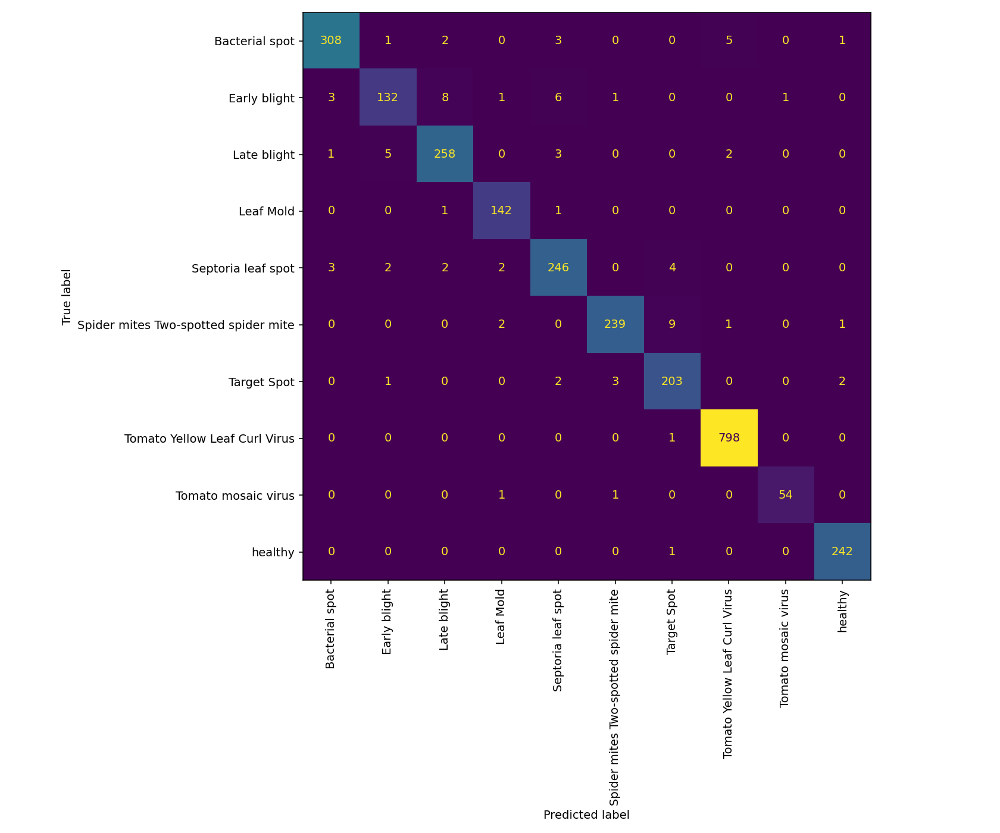
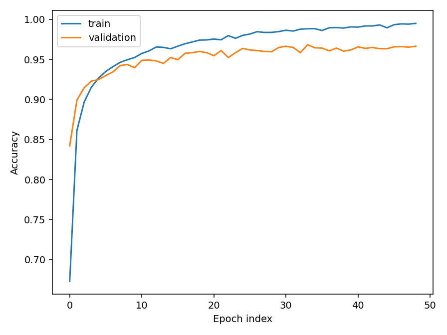

# 🌿 Plant Health Image Classifier

A beginner-friendly computer vision project that classifies a tomato leaf as healthy or one of nine disease/pest categories. Built with **Python, PyTorch, MobileNetV3-Small transfer learning, and Streamlit**.

> **Measured held-out test results — 2,705 images**
>
> | Accuracy | Macro precision | Macro recall | Macro F1 |
> |:---:|:---:|:---:|:---:|
> | **96.93%** | **96.34%** | **95.95%** | **96.13%** |
>
> Validation accuracy: **96.83%** · Selected epoch: **34** · Head training: **49 epochs** · Seed: **42**

## How it works

An ImageNet-pretrained MobileNetV3-Small extracts visual features. A new two-layer neural classification head is trained on PlantVillage tomato images; the feature backbone stays frozen in the published run. Validation accuracy selects the checkpoint, and the separate test set measures final performance. Optional augmentation and end-to-end fine-tuning are included for further experiments.

- **18,146 images**, ten classes; 14 exact pixel duplicates removed.
- Split: **12,820 train / 2,621 validation / 2,705 test** (approximately 70/15/15 by leaf groups).
- Input: 224 × 224 RGB; ImageNet normalisation.
- AdamW; learning rate 0.001; weight decay 0.01; dropout 0.2; cross-entropy.
- Training completed on CPU in **284 seconds**; no end-to-end fine-tuning in this result.
- Supported labels: bacterial spot, early blight, late blight, leaf mold, Septoria leaf spot, spider mites, target spot, yellow leaf curl virus, mosaic virus, and healthy.

## Try the app

```bash
git clone https://github.com/AbheekKaushal/Plant-Health-Image-Classifier.git
cd Plant-Health-Image-Classifier
python3 -m venv .venv
source .venv/bin/activate
python -m pip install -r requirements.txt
streamlit run app.py
```

The trained checkpoint is included in `models/plant_model.pt`. Upload one clear tomato leaf photo to see the top three predictions.

## Reproduce training

```bash
git clone --depth 1 --filter=blob:none --sparse https://github.com/spMohanty/PlantVillage-Dataset.git plant-data
git -C plant-data sparse-checkout set raw/color
python prepare.py --data plant-data/raw/color --leaf-map plant-data/leaf-map.json
python train.py --data plant-data/raw/color
```

Dataset version used: `7f7ecc7e1eaca78107e3affe7cb5abd9427e139a`. The compressed manifest records image paths, hashes, groups, and splits. Downloaded images are excluded from this repository. Results may vary slightly across hardware and library versions.

For an additional fine-tuning experiment (preferably on GPU or Apple Silicon):

```bash
python train.py --data plant-data/raw/color --finetune-epochs 10
```

This overwrites the checkpoint and reports. Keep a copy first; use validation to choose experiments and reserve a new untouched test set if tuning after examining published test results.

## Train on your own images

Arrange labelled photos as `data/my_leaves/<class_name>/<image>.jpg`, then run:

```bash
python prepare.py --data data/my_leaves --prefix '' --out reports/custom_manifest.json
python train.py --data data/my_leaves --manifest reports/custom_manifest.json
```

Use at least ten independent leaf groups per class, ideally hundreds of diverse photos. For multiple photos of one leaf, name files `leaf001.jpg`, `leaf001copy1.jpg`, etc.; the preparer groups that naming pattern. For other naming conventions, supply a `--leaf-map` JSON mapping lowercase image stems to `["class_name:::leaf_id"]`. Personal images were **not** supplied or used in the published training run.

## Results and limitations





Run `python smoke_check.py --data plant-data/raw/color` to verify split isolation, saved-model predictions and app startup. The tested package versions are recorded in `reports/environment.txt`.

Full per-class scores are in [metrics.json](reports/metrics.json), with [training history](reports/history.json) and [test predictions](reports/test_predictions.json.gz).

PlantVillage contains controlled leaf images; **field/phone-photo accuracy is unverified**. The app always chooses one known class, even for unrelated images. Confidence is an uncalibrated model score. This is a portfolio prototype, not a validated crop diagnosis tool.

Split isolation is checked by leaf group. **6,735 images lacked a matching leaf-map entry**, so filename-based fallback groups were used; undetected related leaves may still inflate performance. This split is our own seeded split, not the dataset's official split. No claim of maximum achievable or state-of-the-art accuracy is made.

## References

- [PlantVillage dataset](https://github.com/spMohanty/PlantVillage-Dataset)
- [Mohanty, Hughes & Salathé (2016): Using Deep Learning for Image-Based Plant Disease Detection](https://doi.org/10.3389/fpls.2016.01419)
- [PyTorch transfer learning tutorial](https://docs.pytorch.org/tutorials/beginner/transfer_learning_tutorial.html)

Created by [Abheek Kaushal](https://github.com/AbheekKaushal).
